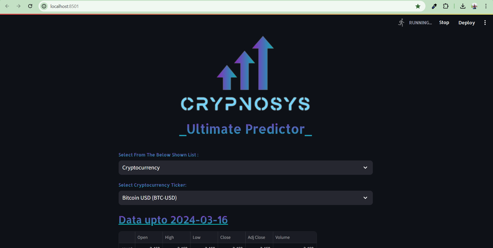
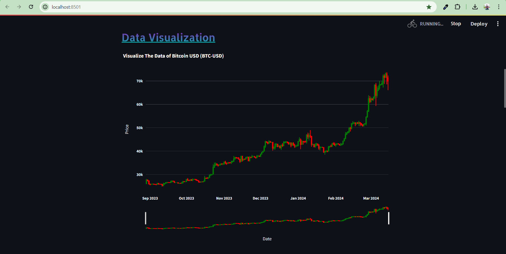
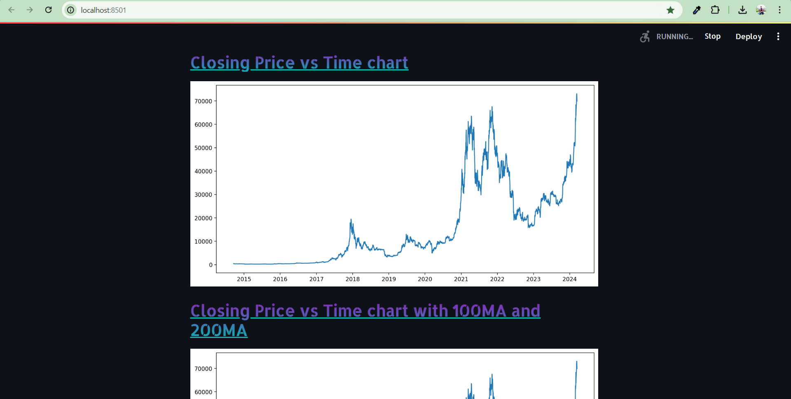
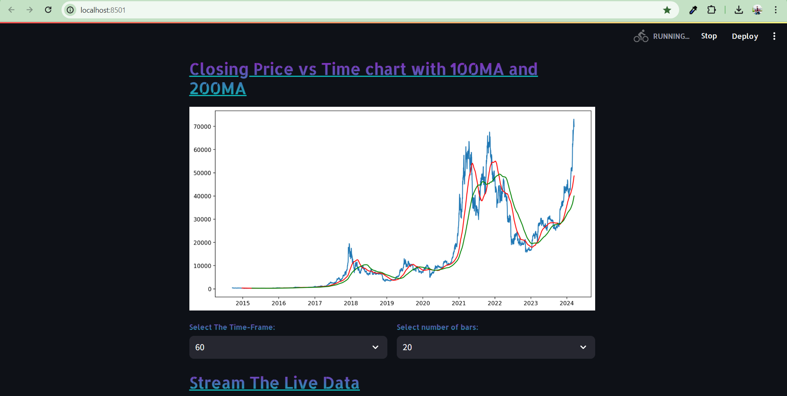
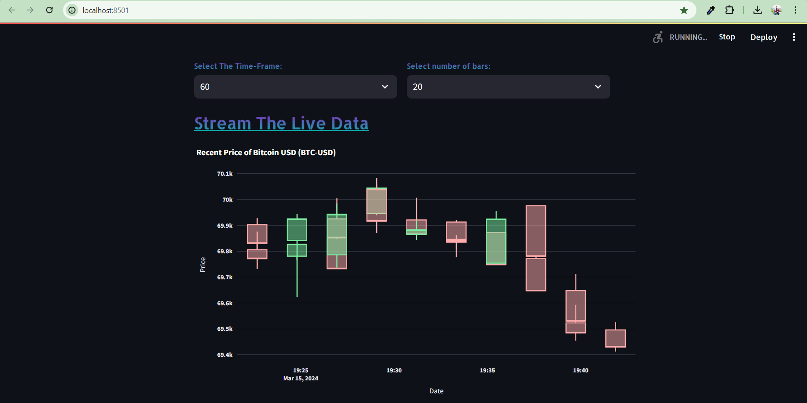
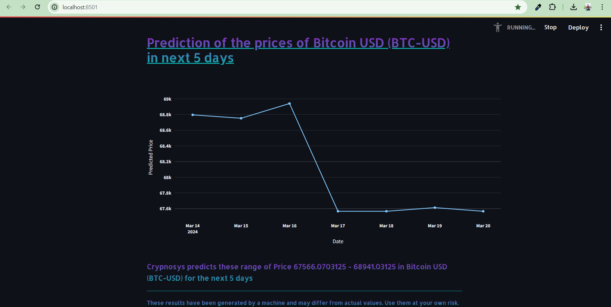

# Crypnosys
## Overview
Crypnosys is a project focused on enhancing the accuracy and reliability of financial asset price predictions using XGBoost, a specialized gradient boosting algorithm known for its effectiveness in modeling sequential data. This presentation delves into the application of XGBoost for forecasting the five-day price trends of financial assets, highlighting its suitability for such tasks.

## Objectives

1. **Data Collection and Cleaning:** Gather and preprocess historical financial data relevant to the forecasting task.

2. **XGBoost Model Design:** Develop a customized XGBoost architecture tailored for accurate forecasting.

3. **Training and Validation:** Partition the dataset, optimize model parameters, and validate the XGBoost model for robust performance.

4. **Performance Evaluation:** Assess the model's accuracy using metrics such as Mean Squared Error (MSE), Mean Absolute Error (MAE), and Root Mean Squared Error (RMSE).

5. **Forecast Generation:** Utilize the trained XGBoost model to predict asset prices for the upcoming five days.

6. **User Interface:** Create an intuitive and user-friendly interface to enhance accessibility and convenience for users.

## Motivation
The complexity and dynamic nature of financial markets often exceed the capabilities of traditional forecasting methods. Crypnosys aims to address this challenge by leveraging XGBoost, a powerful algorithm capable of capturing temporal dependencies in data. By improving prediction accuracy, Crypnosys seeks to facilitate better decision-making processes within the financial industry, offering a creative solution to navigate market complexities.

## Technologies Used
- **Language:** Python
- **Libraries:**
  - XGBoost for building and training the forecasting model
  - Pandas for data manipulation and preprocessing
  - Matplotlib and Plotly for data visualization
  - Scikit-learn for model evaluation and performance metrics

## Data Collection and Preprocessing
In the initial phase, financial data is retrieved from Yahoo Finance, a trusted source. We focus on the 'Close' column, narrowing our analysis to closing prices. To enhance dataset robustness, we normalize using MinMaxScaler, mitigating outliers' impact. Segmentation yields samples of 200 consecutive values, with the 201st as the label. This captures temporal patterns and forms structured input-output pairs for model training.

## XGBoost Model Hyperparameters

- **Number of Trees (Boosting Rounds):** 170
- **Learning Rate:** 0.04
- **Maximum Depth of Each Tree:** 3

This configuration balances complexity and generalization, with 170 trees, moderate learning rate, and limited tree depth. The ensemble captures complex relationships while preventing overfitting.

## Training and Validation
Data is split into 80% training and 20% testing sets. Hyperparameters are fine-tuned (n_estimators=170, learning_rate=0.04, max_depth=3). Model performance is assessed on distinct subsets during training. Testing set validation confirms accuracy within the 80-20 split.

## Evaluation Metrics
Key metrics include Mean Squared Error (MSE), Mean Absolute Error (MAE), and R2 score. These quantify accuracy and precision, offering insights for model refinement across diverse financial instruments and timeframes.

## UI Based System
A web application hosted by Streamlit features:

1. **Asset Selector**: Options include Crypto, Stock, Index, ETF, and Mutual Fund.

2. **Data Table**: Comprehensive information display.

3. **Data Visualization**: Open, Close, High, and Low values for a given day.

4. **Closing Price vs Time Chart**: Normal, 100 MA (Moving Average), and 200 MA options.

5. **Live Data Feed**: Real-time information.

6. **Prediction Module**: Forecasts asset performance for the next five days.

## Screenshots

1. **Asset Selector**
   

2. **Data Visualization**
   

3. **Closing Price vs Time Chart**
   

4. **Closing Price vs Time Chart with 100MA and 200MA**
   

5. **Stream The Live Data**
   

6. **Prediction of the Prices of the Selected Asset in Next 5 Days**
   

## Conclusion
Crypnosys represents a significant advancement in financial forecasting, utilizing XGBoost to predict asset prices with increased precision. Real-time data integration from Yahoo Finance provides actionable insights for investment decisions. This project demonstrates machine learning's capability to identify market trends, paving the way for further financial innovations, ensuring investors navigate the market with greater assurance and effectiveness.
